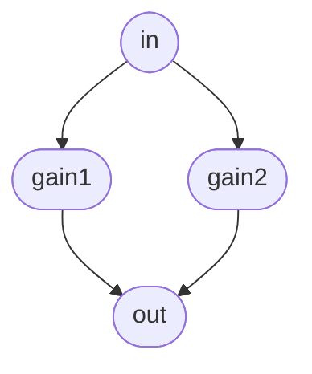

# Setting up Cmajor

To begin, you may want to follow this guide to setup Cmajor with command line tools. This will give you a whole guide to running your first Cmajor patch.

## Download the latest release of Cmajor Binaries

[Click here to download the latest binaries](https://github.com/SoundStacks/cmajor/releases)

On the Github releases page, you'll find downloadable binaries for Mac, Windows and Linux. These provide:

- The command-line tool (`cmaj` or `cmaj.exe`) which provides a compiler, utilities and can load and run Cmajor patches.
- The redistributable libraries (`CmajPerformer.dll` or `libCmajPerformer.so`) which are needed if you build your own native app which incorporates the Cmajor JIT engine.

-------------------------------------------------------------------------------
## Using the `cmaj` command-Line tool

The command line tool can create, build, test and run patches, as well as code-generation of C++ and plugin projects, and various other related utilities.

Installing the command-line app is simply a case of copying the `cmaj` executable to a location of your choice, and running it from a terminal.

For help, run:

```shell
$ cmaj help
```

And it'll show you the latest set of available arguments, e.g.

```
cmaj <command> [options]    Runs the given command. Options can include the following:

    -O0|1|2|3               Set the optimisation level to the given value
    --debug                 Turn on debug output from the performer
    --sessionID=n           Set the session id to the given value
    --engine=<type>         Use the specified engine - e.g. llvm, wasm, cpp

Supported commands:

cmaj help                   Displays this help output

cmaj version                Displays the current Cmajor version

cmaj licenses               Print out legally required licensing details for 3rd-party
                            libraries that are used by this application.

cmaj play file [opts]       Plays a .cmajorpatch, or executes a .js javascript file.

    --no-gui                Disable automatic launching of the UI in a web browser
    --stop-on-error         Exits the app if there's a compile error (default is to keep
                            running and retry when files are modified)

cmaj test [opts] <files>    Runs one or more .cmajtest scripts, and print the aggregate results
                            for the tests. See the documentation for writing tests for more info.

    --singleThread          Use a single thread to run the tests
    --threads=n             Run with the given number of threads, defaults to the available cores
    --runDisabled           Run all tests including any marked disabled
    --testToRun=n           Only run the specified test number in the test files
    --xmlOutput=file        Generate a JUNIT compatible xml file containing the test results
    --iterations=n          How many times to repeat the tests

cmaj render [opts] <file>   Renders the given file or patch

    --length=<frames>       The number of frames to render (optional if an input audio file is provided)
    --rate=<rate>           Use the specified sample rate (optional if an input audio file is provided)
    --channels=<num>        Number of output audio channels to render (default is 2 if omitted)
    --blockSize=<size>      Render in the given block size
    --output=<file>         Write the output to the given file
    --input=<file>          Use input from the given file
    --midi=<file>           Use input MIDI data from the given file

cmaj generate [opts] <file> Generates some code from the given file or patch

    --target=<type>         The type of code to generate - can be cpp|wasm|wast|plugin|module|syntaxtree
    --output=<file>         Write the generated runtime to the given file (or folder for a plugin)
    --jucePath=<folder>     If generating a JUCE plugin, this is the path to your JUCE folder
    --cmajorIncludePath=<folder>  If generating a plugin, this is the path to your cmajor/include folder

cmaj create [opts] <folder> Creates a folder containing files for a new empty patch

    --name="name"           Provides a name for the patch

cmaj unit-test              Runs internal unit tests.

    --iterations=n          How many times to repeat the tests
```

## Playing a patch with the console app

To get started, you might want to try some of the example patches using `cmaj play`:

```shell
$ cmaj play /path-to-your-repo/examples/HelloWorld/HelloWorld.cmajorpatch
```

This will open a window to display any controls that the patch may provide, and you should hear a nice tune playing. If you've got a MIDI keyboard then it should be opened and sent to the running patch (if it needs MIDI input).

There are command-line options to give you a bit more control over which audio and MIDI devices are used, but the command-line app is only attempting to be a quick-and-dirty patch player. For more serious control, you probably want to load your patch into a proper audio host via our Cmajor JIT plugin, which will let you route it however you like, and provide any kind of i/o to it.

While running a patch, the console app will detect any file changes and recompile/reload, so you can quickly experiment with changes to your code.

## Creating a new empty patch

To get started with a new patch, the `cmaj` app can generate the basic boilerplate files needed. Just run:

```shell
$ cmaj create --name="Hello" MyNewPatchFolderName
```

This creates a new folder containing a patch called "Hello" that can be explored, renamed and built upon. For in-depth details on how these files work, see the [Patch Format Guide](./Cmaj%20Patch%20Format.md)

-------------------------------------------------------------------------------

## Coding in Cmajor: High-Level Overview

This is a very quick summary of the main concepts in Cmajor. For a deep dive on the language syntax, see the [Language Guide](./Cmaj%20Language%20Guide.md)


#### Programs vs Patches

A Cmajor *program* refers to any collection of processors, graphs and namespaces. A host app can load a Cmaj program, instantiate a *processor* and use it to render audio (or any other type of data).

A Cmajor *patch* is a bundle which has a form that makes it suitable for use as an audio plugin. A patch is folder containing metadata files, program files, and other resources (such as GUI scripts and audio files) which a DAW-like host can load and use like, in the same way they might load a traditional plugin such as a VST or AU.

The Cmajor tools include utilities to load patches via a VST/AU plugin, and can also code-generate a native VST/AU plugin from a patch.


#### Processors and Graphs

The main high-level structures in Cmajor that differ from other languages are the `processor` and `graph` objects.

#### `graph` declarations

A `graph` declares a set of nodes (which are either low-level `processor` objects or other graphs), and a list of connections between them.

```cpp
// Example of a graph declaration:
graph TwoGainsInSeries
{
    // This section declares the inputs and outputs of the graph:
    input  stream float in;
    output stream float out;

    // This section declares the nodes:
    node gain1 = GainProcessor;  // declare two nodes, each one a GainProcessor
    node gain2 = GainProcessor;

    // And here we list the connections between the nodes:
    connection in -> gain1 -> gain2 -> out;  // send our input through both gains, and the result to our output
}
```



#### `processor` declarations

Unlike a graph, a `processor` contains functions to perform its number crunching, rather than nodes.

Every `processor` must provide a `main()` function. This usually contains an infinite loop which reads from its inputs, performs some kind of processing, writes to its outputs, and repeats this for the lifetime of the object.

```cpp
// Example of a processor declaration:
processor GainProcessor
{
    input  stream float in;    // declare an input and output stream of floats
    output stream float out;

    void main()
    {
        loop   // infinite loop
        {
            out << in * 0.5f;  // read our next input value, multiply by 0.5, and send it to our output
            advance();         // advance to the next frame
        }
    }
}
```

A program can also contain `namespace` declarations containing helper functions, data types, and constants that the processors can use.

## Creating your first patch - Hello, World!

Let's start with a simple sine-wave patch with a gain control, to demonstrate how to create a custom processor, connect it up inside a graph, and provide a parameter to control something from the GUI.

### Step 1 - Create a New Patch

Start by using the command-line app to create a new, empty patch:

```shell
$ cmaj create AnnoyingBeep
```

This creates a basic patch in a folder called "AnnoyingBeep". If you have a look inside at the file called `AnnoyingBeep.cmajor`, it'll look something like this:

```cpp
graph AnnoyingBeep  [[main]]
{
    output stream float out;

    node sine = std::oscillators::Sine (float, 440);

    connection sine -> std::levels::ConstantGain (float, 0.15f) -> out;
}
```

If you start the patch running with:

```shell
$ cmaj AnnoyingBeep/AnnoyingBeep.cmajorpatch
```

Then you should hear a sine wave playing. While it's running, try opening an editor on the `AnnoyingBeep.cmajor` file, and modify the "440" to change its pitch. When you re-save the file, the player should pick this up and you'll hear the sound changing.

As an example, let's update the code to add a parameter for the volume. Try changing the code to:

```cpp
graph AnnoyingBeep  [[main]]
{
    output stream float out;
    input gain.volume;

    node sine = std::oscillators::Sine (float, 440);
    node gain = std::levels::SmoothedGain (float);

    connection sine -> gain.in;
    connection gain.out -> out;
}
```

..and you should see a "Volume" parameter appear on the GUI which controls the level, and you'll be relieved to be able to turn it down.

If you type anything wrong, you'll see the GUI go blank, and the command-line app will show you the compile errors.

Now let's add a parameter to control the pitch:

```cpp
graph AnnoyingBeep  [[main]]
{
    output stream float out;
    input gain.volume;
    input sine.frequencyIn;

    node sine = std::oscillators::Sine (float, 440);
    node gain = std::levels::SmoothedGain (float);

    connection sine -> gain.in;
    connection gain.out -> out;
}
```

..and when you save that, the GUI should update to now have two parameter controls for volume and pitch.

Have fun exploring - there are lots more examples to look at in the 'examples' folder!
